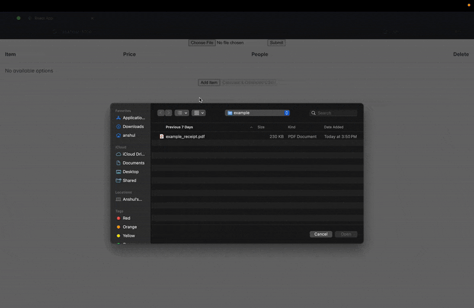

# 🧾 Receipt Parser & Bill Splitter

A lightweight web application that parses grocery receipts from **PDF files** and helps you split the bill among multiple people.

---

## 📸 Demo



---

## ⚙️ Tech Stack

- **Backend**: [Go Fiber](https://gofiber.io/) — for fast, minimalist API development  
- **Frontend**: [React](https://react.dev/) + [PrimeReact](https://primereact.org/) — for dynamic tables and UI  
- **OCR**: [Amazon Textract](https://aws.amazon.com/textract/) — to extract structured line items from receipts  
- **Storage**: [Amazon S3](https://aws.amazon.com/s3/) — to hold uploaded PDF files before processing

---

## 📥 How It Works

1. Upload a **one-page grocery receipt** (PDF format only).
2. Amazon Textract analyzes the receipt and extracts:
   - Each line item (item name, price)
   - The subtotal and tax
3. A dynamic table displays the parsed items. You can:
   - Edit item names and prices
   - Assign people to each item (comma-separated)
   - Add or delete items
4. The app shows whether the total matches the sum of all items.
5. Click **Calculate** to download a CSV with each person’s total (tax distributed proportionally).

> 💡 **Note**: If your receipt is longer than one page, use an online tool to flatten it into a single-page PDF. Amazon Textract’s `AnalyzeExpense` does not currently support multi-page PDFs directly from memory.

---

## 🚀 Getting Started

### Prerequisites

- [Docker](https://www.docker.com/)
- AWS credentials with permission to use Textract and S3

## 🔧 Setup Instructions

### 1. Clone the Repository

```
git clone https://github.com/your-username/receipt-parser.git
cd receipt-parser
```

### 2. Create Your Environment File
```
AWS_REGION=us-east-1
AWS_ACCESS_KEY_ID=your_access_key
AWS_SECRET_ACCESS_KEY=your_secret_key
S3_BUCKET=your-s3-bucket-name
```
Make sure your IAM user has permission to use Amazon Textract.


### 3. Start the Backend (Go + Fiber via Docker)
`docker compose up --build`


### 4. Start the Frontend (React App)
Open a new terminal tab and run:
```
cd frontend
npm install
npm run start
```

### 5. Open in Browser
Visit your app at: http://localhost:3000

