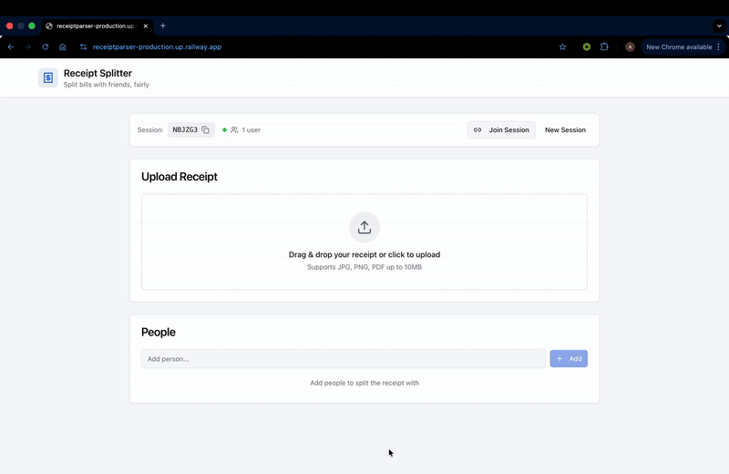

# 🧾 Receipt Parser & Bill Splitter

A lightweight web application that parses grocery receipts from **PDF files** and helps you split the bill among multiple people.

---

## 📸 Demo

---

## ⚙️ Tech Stack

- **Backend**: [Go Fiber](https://gofiber.io/) — for fast, minimalist API development  
- **Frontend**: [React](https://react.dev/) + [Tailwind CSS](https://tailwindcss.com/) + [Shadcn/UI](https://ui.shadcn.com/) — For a modern, responsive, and accessible interface.
- **OCR**: [Amazon Textract](https://aws.amazon.com/textract/) — to extract structured line items from receipts  

---

## 📥 How It Works

1. Upload a **one-page grocery receipt**.
2. Amazon Textract analyzes the receipt and extracts:
   - Each line item (item name, price)
   - The subtotal and tax
3. A dynamic table displays the parsed items. You can:
   - Edit item names and prices
   - Assign people to each item
   - Add or delete items
4. The app shows whether the total matches the sum of all items.
5. Click **Calculate** to download a CSV with each person’s total (tax distributed proportionally).

> 💡 **Note**: If your receipt is longer than one page, use an [online tool] to flatten it into a single-page PDF. Amazon Textract’s `AnalyzeExpense` does not currently support multi-page PDFs directly from memory. NOT SPONOSORED: https://avepdf.com/convert-to-one-page-pdf

---
